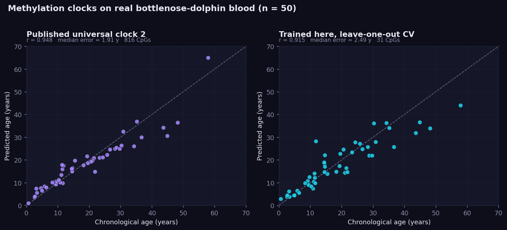
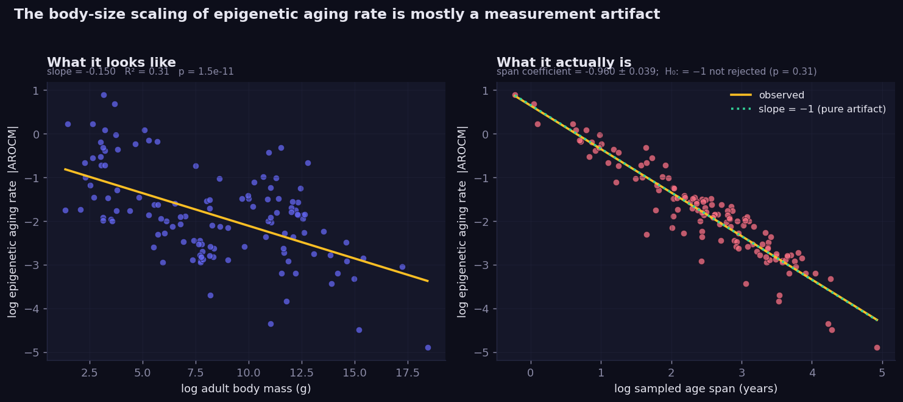
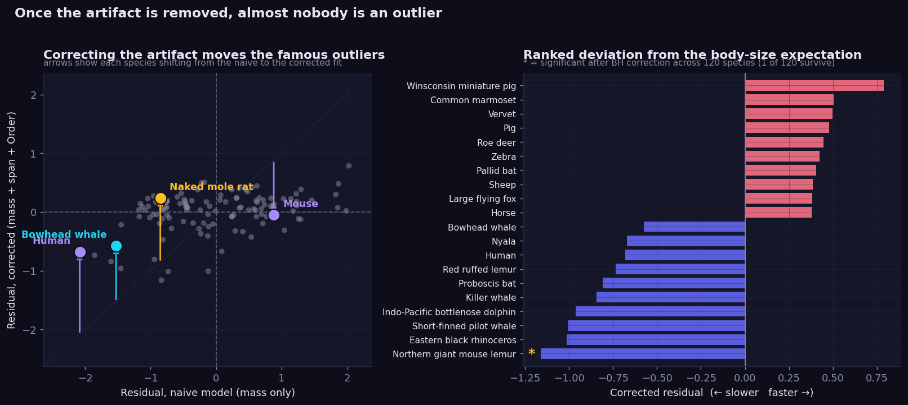
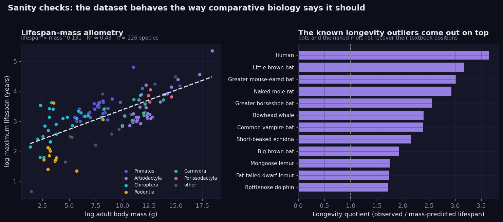
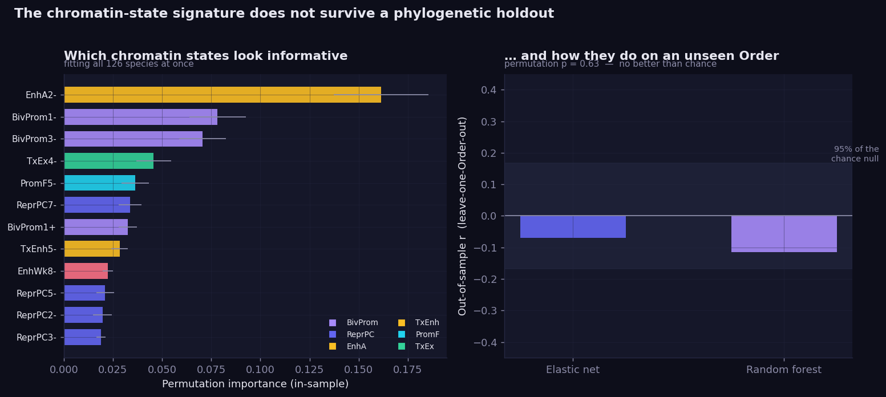
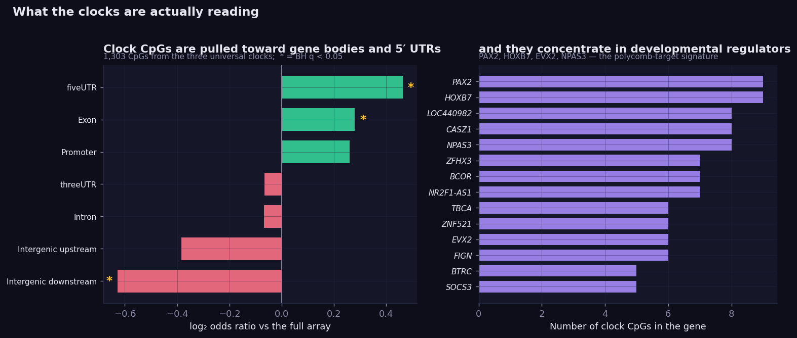

# Mammalian methylation clocks: what the residuals actually say

A pan-mammalian DNA methylation ageing analysis built end to end on the real
[Mammalian Methylation Consortium](https://github.com/shorvath/MammalianMethylationConsortium)
release. 126 species, 15 taxonomic orders, 11,112 arrays, 54 chromatin states.

**[Interactive dashboard](https://ralegionc.github.io/Metabolism_Rate/)** ·
**[Findings](FINDINGS.md)** ·
**[Notebook](notebooks/mammalian_methylation_residuals.ipynb)**

---

## The short version

Methylation clocks predict chronological age across mammals with real accuracy.
Reproducing them here: the published universal clock hits **r = 0.948** on 50
real bottlenose dolphin blood samples, and a clock trained from scratch on the
same 37,554-site array reaches **r = 0.915** while independently rediscovering 7
of the published clock's CpG sites (1.08 expected by chance).

The obvious next question is which species age faster or slower than their body
size predicts. Naked mole rats and bowhead whales are the textbook candidates.

That question mostly dissolves under inspection. The standard cross-species rate
measure is the slope of *z-scored* methylation on age, which makes it
mechanically proportional to `1/SD(sampled ages)`. Species sampled across wider
age ranges get lower rates for reasons unrelated to biology, and long-lived
species are necessarily sampled across wider ranges.

Fitting it directly, the coefficient on sampled age span is **-0.960 ± 0.039**.
A pure artifact predicts exactly -1, and that null **cannot be rejected**
(p = 0.311). The body-mass coefficient shrinks **88.9%** and loses significance.
After multiple-testing correction, **1 of 126 species** remains a defensible
outlier. The naked mole rat's residual reverses sign.

What survives is the clock itself, and where it reads: the clock CpGs are
enriched in 5' UTRs and exons and concentrate in developmental transcription
factors (PAX2, HOXB7, EVX2, NPAS3, BCOR, ZNF521), the polycomb signature every
methylation clock converges on.

## Figures

| | |
|---|---|
|  |  |
|  |  |
|  |  |

## Pipeline

Run `01_ingest.py` first. It rebuilds `data/processed/dolphin_betas.parquet`,
which is 18 MB of derived data and therefore not kept in git; every later step
depends on it.

```bash
pip install -r requirements.txt

python src/01_ingest.py          # parse consortium release into tidy tables
python src/02_clock_validation.py # published clocks + from-scratch, nested CV
python src/03_aging_rate_model.py # allometry, residuals, outlier tests
python src/04_interpretability.py # chromatin states, leave-one-Order-out ML
python src/05_figures.py          # dark-theme publication figures
python src/06_build_dashboard.py  # single-file D3 dashboard -> docs/index.html
python src/07_make_notebook.py    # annotated notebook (regenerated unexecuted;
                                  #   run it in Jupyter to restore outputs)
python src/08_verify.py           # 119 independent checks on every quoted number
```

Total runtime is about four minutes on two cores.

`08_verify.py` deliberately does not import the analysis modules. It recomputes
each headline number from the raw files by a different route, greps the write-ups
for the values they quote, and audits every module's syntax tree to confirm no
random-data-generating call exists anywhere in the pipeline. If a number in the
prose ever drifts from the data, it fails.

### `src/rds_reader.py`

A standalone dependency-free reader for R `.RDS` files, written because
`pyreadr` silently returns an empty dict when the top-level object is a bare
list rather than a data frame, which is exactly how the consortium ships
`mydata_GitHub.Rds`. It implements the subset of R's serialization grammar those
files use, including the reference table and compact integer sequences. Useful
on its own:

```python
from rds_reader import read_rds, to_dataframe
obj = read_rds("mydata_GitHub.Rds")   # nested lists, data frames, attributes
```

## Method notes

Choices that materially affect the conclusions:

- **The variance prefilter is refit inside every cross-validation fold** and
  never sees the age labels, so it cannot leak outcome information. With 50
  samples and 37,554 sites this is the difference between an honest error
  estimate and a flattering one.
- **Outliers are flagged with externally studentized residuals plus
  Benjamini-Hochberg**, not by ranking. Bootstrap resampling of species
  estimates uncertainty in the *fitted line*, which is a different question and
  gives misleadingly narrow intervals if used for per-species significance.
- **The machine learning holds out whole taxonomic orders.** Random
  cross-validation across 126 species leaks phylogeny: close relatives share
  both chromatin dynamics and lifespan, so a random split lets the model
  memorise lineages. Leave-one-Order-out is the honest test, and it is the test
  the chromatin-state signature fails.
- **The state-contrast measure** divides each chromatin state's rate by the
  species' own genome-wide mean, which cancels the `1/SD(age)` term exactly and
  gives an artifact-free phenotype.

## Data provenance

Everything derives from the consortium's public GitHub release:

- `mydata_GitHub.Rds`: dolphin beta matrix, universal clock coefficients, anAge traits
- `SupplementTable3_AROCM_Strata_v4.csv`: per species-tissue slopes across 54 chromatin states
- `SupplementTable4_SlopesBySpecies_BivProm2+.csv`: headline species rates
- `Homo_sapiens.hg38.HorvathMammalMethylChip40.v1.csv`: CpG to gene annotation

Primary references: Lu et al., *Universal DNA methylation age across mammalian
tissues*, **Nature Aging** (2023); Fei et al., *Fundamental equations linking
methylation dynamics to maximum lifespan in mammals*. Full arrays are in GEO
accession **GSE223748**, which the pipeline is structured to accept in place of
the summary tables.

## Repository layout

```
data/raw/          consortium source files (small ones, vendored)
data/processed/    tidy tables produced by the pipeline
results/           model output as JSON
figures/           publication figures
docs/index.html    self-contained interactive dashboard
notebooks/         executed analysis notebook
writing/           long-form article and short post
src/               pipeline
```
